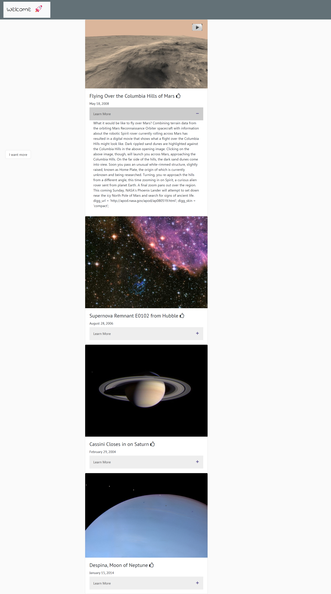
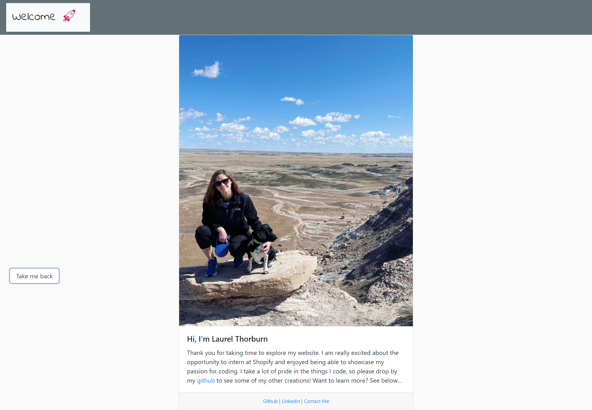

# Spacestagram: Image-sharing from the final frontier 🚀

<a name="descsection"></a>
## Description

The purpose of this project was to share photos from one of NASA's APIs (APOD: Astronomy Picture of the Day) and to support Shopify extend their mission of "Making Commerce Better" for everyone in the universe.   This site was created using Handlebars, Bootstrap, Font Awesome, JavaScript, HTML, and CSS.  The user is able to like/unlike their favorite photos, render new media, and expand content in order to learn more about the media of their choosing.  

[](https://opensource.org/licenses/MIT)

  <a name="linksection"></a>
  ## Links
  
  Deployed Heroku Site: https://rocketship-dreamer.herokuapp.com/

  Github Site: https://github.com/laurelthorburn/Rocketship-Challenge-2022

## Table of Contents
1. [ Description. ](#descsection)
2. [ Links. ](#linksection)
3. [ User Story. ](#usersection)
4. [ Acceptance Criteria. ](#acceptancesection)
5. [ Installation. ](#installsection)
6. [ Usage. ](#usagesection)
7. [ License. ](#licensesection)
8. [ Contributing. ](#contribsection)
9. [ Questions. ](#questionssection)
10. [ Screenshots. ](#picsection)
11. [ Resources/Credit. ](#creditsection)

<a name="usersection"></a>
## User Story
```
AS A USER, I want to be able to view media from one of NASA's APIs
SO THAT I can like and unlike posts and learn more about how I can make commerce better for everyone
```

<a name="acceptancesection"></a>
## Acceptance Criteria
```
  WHEN I load the page then I am presented with four media (i.e., images and/or videos) from a NASA API, APOD
  THEN I am able to see the title of the media, date of capture, and more content
  WHEN I click the like button, I am able to like/unlike the image/video
  WHEN I click the "I want more" button, four new images and/or videos are rendered
  WHEN I click on a media, I am taken to a new tab with the url of that image/video
  WHEN I hover over the "Welcome" text, my mouse turns into a star and I am able to click a hidden button
  WHEN I click the hidden button, then I presented with an about Laurel page
  THEN I am able to learn more about Laurel and why she would be a great addition to the Shopify team
  
```

<a name="installsection"></a>
## Installation
* Clone the repository using:
```
git clone https://github.com/laurelthorburn/Rocketship-Challenge-2022.git
```
* Ensure you are in the current working directory
* Open terminal in working directory and type:
```
npm init
```
* Install dependencies by opening the terminal (ctrl + j on windows) and running:
```
npm install
```

<a name="usagesection"></a>
## Usage
*  After following user installation guide above, open root folder in the integrated terminal and type in the following:
```
npm run start (only works if nodemon is installed)
```
* Open your localhost:3001 
* Enjoy!

<a name="licensesection"></a>
## License
Copyright <2021>

Permission is hereby granted, free of charge, to any person obtaining a copy of this software and associated documentation files (the "Software"), to deal in the Software without restriction, including without limitation the rights to use, copy, modify, merge, publish, distribute, sublicense, and/or sell copies of the Software, and to permit persons to whom the Software is furnished to do so, subject to the following conditions:

The above copyright notice and this permission notice shall be included in all copies or substantial portions of the Software.

THE SOFTWARE IS PROVIDED "AS IS", WITHOUT WARRANTY OF ANY KIND, EXPRESS OR IMPLIED, INCLUDING BUT NOT LIMITED TO THE WARRANTIES OF MERCHANTABILITY, FITNESS FOR A PARTICULAR PURPOSE AND NONINFRINGEMENT. IN NO EVENT SHALL THE AUTHORS OR COPYRIGHT HOLDERS BE LIABLE FOR ANY CLAIM, DAMAGES OR OTHER LIABILITY, WHETHER IN AN ACTION OF CONTRACT, TORT OR OTHERWISE, ARISING FROM, OUT OF OR IN CONNECTION WITH THE SOFTWARE OR THE USE OR OTHER DEALINGS IN THE SOFTWARE.

  <a name="contribsection"></a>
## Contributing
  
This is a private project and is not taking contributors at this time.  Instead, please leave an encouraging comment and cross your fingers that I get an interview!

  <a name="questionssection"></a>
## Questions?
  Want to see more of my work? [Click here!](https://github.com/laurelthorburn)

  Questions/comments/concerns? Please send an email to codinglaurel@gmail.com

  <a name="picsection"></a>
  ## Screenshots
  
  

  <a name="creditsection"></a>
## Resources/Credit
* https://api.nasa.gov/
* https://github.com/nasa/apod-api
* https://developer.mozilla.org/en-US/docs/Web/JavaScript/Reference/Global_Objects/Date/toLocaleDateString
* https://stackoverflow.com/questions/5223/length-of-a-javascript-object
* https://developer.mozilla.org/en-US/docs/Web/JavaScript/Reference/Global_Objects/Object/getOwnPropertyNames
* https://www.w3schools.com/howto/howto_js_toggle_like.asp
* https://www.w3schools.com/howto/howto_js_accordion.asp
* https://pixabay.com/vectors/youtube-logo-graphic-red-1837872/
* https://www.youtube.com/watch?v=xuA83OYTE7I
* https://developers.google.com/youtube/player_parameters


